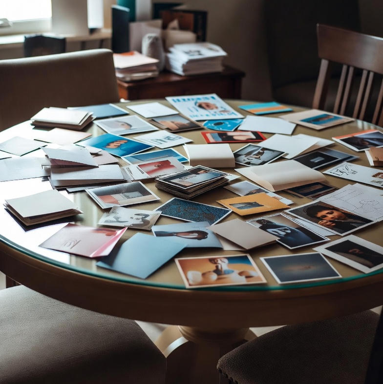
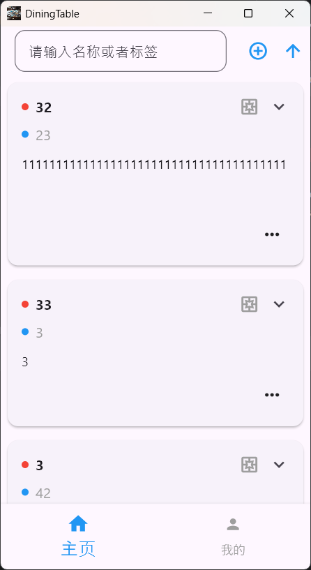
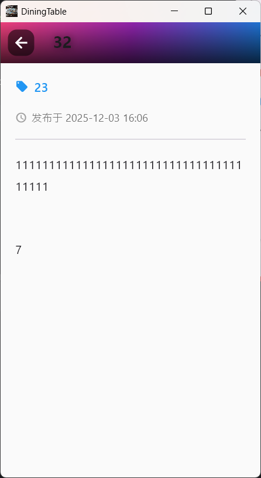
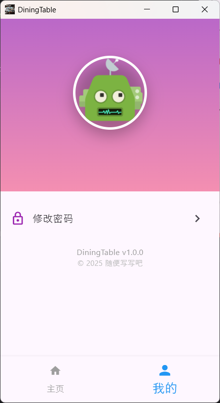

<h1>
  
  DiningTable
</h1>

> Use simple cards to carry memories and place them on the dining table.

# Support platforms

Theoretically, it supports all of them. Windows and Android have been tested and supported, but others have not been tested.

### build apk:  
> flutter build apk --release --split-per-abi --obfuscate --tree-shake-icons --split-debug-info=build/debug_info

<table style="width:100%; table-layout:fixed;">
  <tr>
    <td style="width:33%; padding:0;">
      
    </td>
    <td style="width:33%; padding:0;">
      
    </td>
    <td style="width:33%; padding:0;">
      
    </td>
  </tr>
</table>
